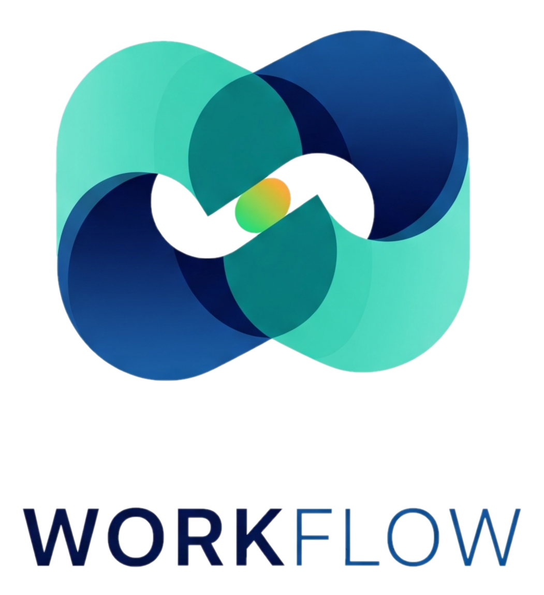

<p align="center">
  
</p>
<h1 align="center">WORKFLOW</h1>

<p align="center">
  <a href="https://protik1810.github.io/WorkFlow/"></a>
  
  
  
  
</p>

<p align="center">
  <strong>A comprehensive desktop application for managing project workflows, from inception to fulfillment and financial tracking.</strong>
</p>

<p align="center">
  </p>

## ✨ Key Features

* **Complete Project Lifecycle**: Manage standard, tender, and limited-tender projects from initial inquiry and department memos to final work completion certificates.
* **Financial Tracking**: Keep a detailed record of client transactions and vendor payments to monitor project profitability in real-time.
* **Document Management**: Upload and link all relevant documents—from proposals and work orders to invoices and challans—directly to your projects.
* **User Management**: Secure user authentication with login, signup, profile locking, and customizable user profiles.
* **Native Windows Experience**: Designed to be fast and reliable on your Windows PC.
* **Custom Theming**: Switch between multiple light and dark themes for a personalized experience.

## 📥 Downloads

You can download the latest pre-compiled version of WORKFLOW for Windows from the **[Releases Page](https://github.com/Protik1810/WorkFlow/releases)**.

* **[Download for Windows (.exe)](https://github.com/Protik1810/WorkFlow/releases/latest/download/WORKFLOW_Setup_v2.0.0.exe)**

Website : **[protik1810.github.io/WorkFlow](https://protik1810.github.io/WorkFlow/)** 

## 🚀 Running from Source

To run the application from the source code, follow these steps:

1.  **Prerequisites**
    * Python 3.12
    * Git

2.  **Clone the repository:**
    ```bash
    git clone [https://github.com/Protik1810/WorkFlow.git](https://github.com/Protik1810/WorkFlow.git)
    cd WorkFlow
    ```

3.  **Install dependencies:**
    ```bash
    pip install -r requirements.txt
    ```

4.  **Run the application:**
    ```bash
    python main.py
    ```

## 🛠️ Technologies Used

* **Backend**: Python
* **GUI**: PyQt6
* **Database**: SQLite
* **Installer (Windows)**: Inno Setup

## 📄 License

This project is licensed under the **GNU General Public License v3.0**.
